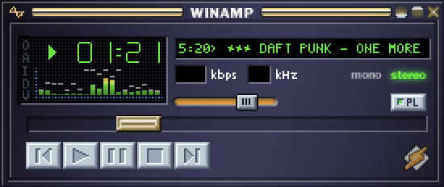
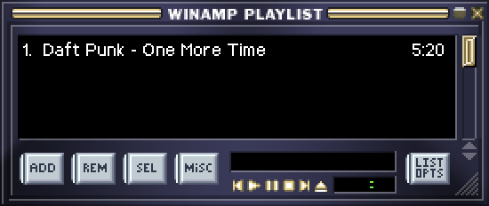

# Spotiamp

A Spotify client with a Winamp Classic (2.95) look.
It is work in progress, mostly a fun project for me personally to try out Svelte 5 and Tauri 2.
If you like it and miss your favourite Winamp Classic feature add an issue about it or even better create a PR.

Check [releases](https://github.com/tedsteen/Spotiamp/releases/) for MacOS and Windows binaries.
<p align="center">
  
  <br />
  
</p>

## Building and running
```bash
# Install all
npm i
cargo install tauri-cli

# After that run this to dev
cargo tauri dev
```

## Update version
```bash
pnpx tauri-version patch # `v0.0.2` -> `v0.0.3` - Commit message `0.0.3`
pnpx tauri-version minor # `v0.0.2` -> `v0.1.0` - Commit message `0.1.0`
pnpx tauri-version major # `v0.0.2` -> `v1.0.0` - Commit message `1.0.0`
```

## Trigger release (run the publish workflow)
```bash
git push origin tag v[version number]
```